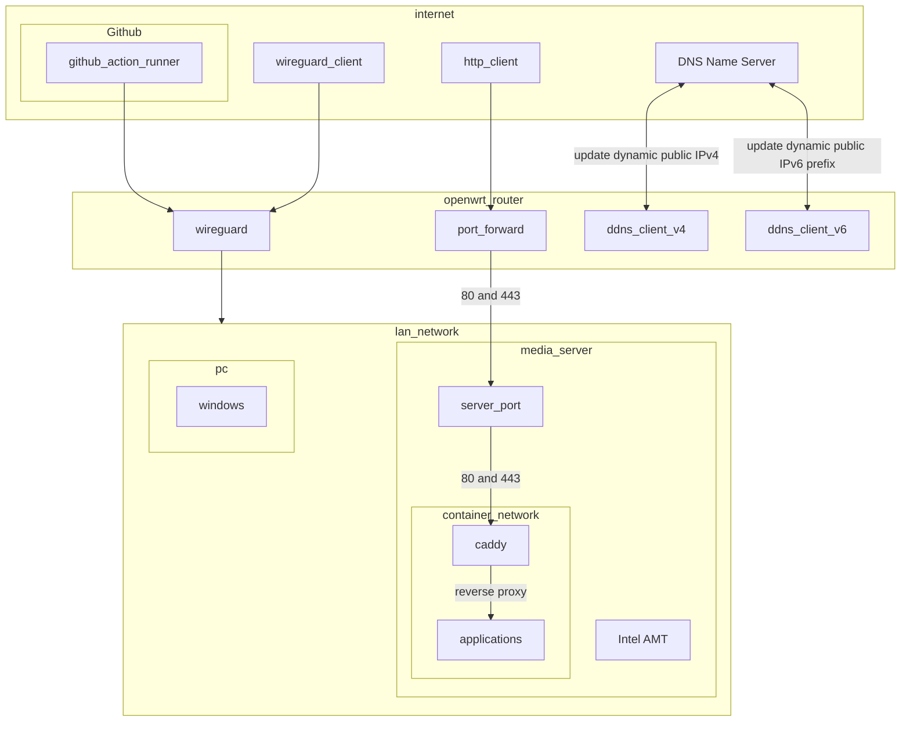
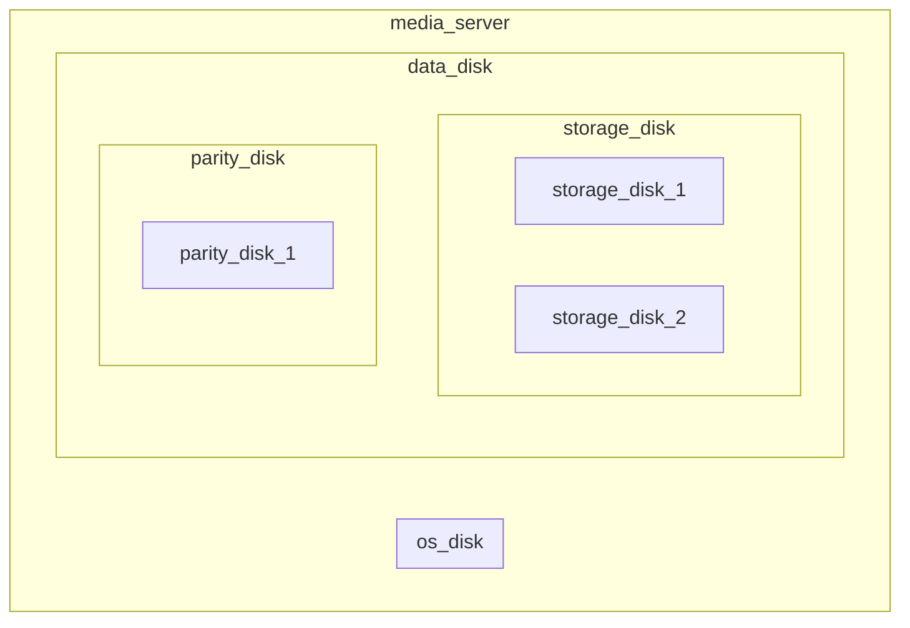

# Selfhost Server

[](https://github.com/zephyros-dev/media-server/actions/workflows/deployment.yaml)

Code for running self-hosted services using podman and ansible

Want to know more about selfhosting a media server? [Checkout the docs](docs/README.md)

## Infrastructure graph

### Networking



#### Data



## Note

- Always run partition playbook with --check first

  ```bash
  ansible-playbook partition --check
  ```

### PC

#### Intel AMT support

- It's possible to control the PC remotely from BIOS via Intel AMT
- Setup:

1. Enable Intel AMT
2. Enable the integrated GPU in the BIOS in case of using a discrete GPU (NVIDA, AMD)
3. Set the integrated GPU as the default GPU in the BIOS
4. Use [Intel software](https://software.intel.com/sites/manageability/AMT_Implementation_and_Reference_Guide/default.htm?turl=WordDocuments%2Ftoolsusingkvm.htm) for setting up KVM (remote mouse and keyboard) to the PC. For cross-platform open source solution, checkout [Meshcentral in a container](https://github.com/Typhonragewind/meshcentral-docker)

#### Boot from Nvme

- I used a HPZ230 for the server with an NVME hard drive in the PCIE slot.
- The mainboard does not allow booting from PCIE slot directly, so I have to boot from [Cloverboot](https://github.com/CloverHackyColor/CloverBootloader) installed in an USB.
  - It can be installed by downloading the release from the github page and burn the ISO to the USB. The name is `CloverISO-<revision>.tar.lzma`
  - After burning the ISO into USB, copy the EFI\CLOVER\drivers\off\NvmExpressDxe.efi to EFI\CLOVER\drivers\UEFI
  - In the BIOS, set the boot order to boot from USB first
  - Then set the following settings in the BIOS
    - Advanced -> Option ROM Launch Policy -> Storage Options Rom -> UEFI only

#### WOL

- In the BIOS, enable wol via Advanced -> Device Options -> S5 Wake on LAN

#### OS

#### Ucore (rpm-ostree variants)

<https://github.com/ublue-os/ucore>

#### Services

##### Koreader connection to opds Calibre content server

- The koreader opds requires `/opds` path to the calibre content server
- The calibre content server authentication need to be `digest` for the koreader opds

## Maintenance notes

### Postgres major version update

- To upgrade postgres major version, do the following
  1. Change the `postgres_action` key in variable files to `export` and run the playbook for that container
  2. Change the image tag to the next major version
  3. Change the `postgres_action` key in variable files to `import` and run the playbook for that container
  4. Change the `postgres_action` key in variable files to `none` and run the playbook for that container
  5. Check if the container startup correctly
  6. Change the `postgres_action` key in variable files to `clean` and run the playbook to cleanup the previous backup

#### Restic restores

1. Source the secret files to current shell

   ```bash
   ## Fish shell
   . (sed 's/^/export /' /etc/restic/restic.env | psub)
   ```

2. Get list of snapshots

   ```bash
   restic snapshots
   ```

3. Restore the files (remove the --dry-run once satisfied)

   ```bash
   restic restore -v <snapshot-id> --target / --include <absolute-path-to-restore> -v --dry-run
   ```

## Troubleshooting

### CI debugging

- To debug the CI, run the following command

  ```bash
  dagger run -i python ci/deployment.py
  ```

#### Kavita

##### Kavita failed to save progress

- Consult [this](https://wiki.kavitareader.com/en/faq##q-im-seeing-database-is-locked-errors-in-my-logs)

#### Nextcloud

##### Stuck in maintenance mode

1. Rebuild nextcloud

   ```bash
   ansible-playbook main.yaml --tags nextcloud
   ```

###### Debug postgres

1. Run the following command to enable adminer container for accessing postgres database

   ```bash
   ansible-playbook main.yaml --tags nextcloud --extra-vars '{"debug":true}'
   ```

#### Container name with pod exists

- Check if the container exists as external storage in podman then remove that container

  ```bash
  podman ps --external
  ```

- Reference
  - <https://docs.podman.io/en/latest/markdown/podman-ps.1.html##external>
  - <https://github.com/containers/podman/issues/3983>

#### Pymedusa

##### Pymedusa failed create hardlink

- Check [this](roles/pymedusa/README.md)

###### Check failed to hardlink file

- Run this command in the Video folder

  ```bash
  find . -type f -links 1 ! -name "*.srt" -print
  ```

<!-- TODO: Write a scheduled monitoring for this -->

#### Reinstallation note

- If the server is reinstalled, some steps need to be taken:

  - Podman: Reset podman for rootless user

  ```bash
  podman system reset
  ```

- Renovate can be visisted at: <https://developer.mend.io>

## Misc

1. Why HP Z230?

- The PC itself is a bit old, and the bios is no longer updated. However, it is good for home usage due to the following reasons:
  - Can be cheaply build with a Xeon E3-1230v3 CPU
  - Has 4 DIMM DDR3 slots, and support for ECC memory. DDDR4 ECC memory can be expensive
  - Has 2 GPU slots, though I don't really need SLI
  - Has Intel AMT support, so I can have headless remote access to the BIOS for troubleshooting
- It has some annoyances however:
  - The mainboard has no Nvme slot, and does not allow booting from PCIE slot directly, but can be solved via Cloverboot option from above
  - Has little room for HDD (2 by default), but can be solved by using a HDD cage
