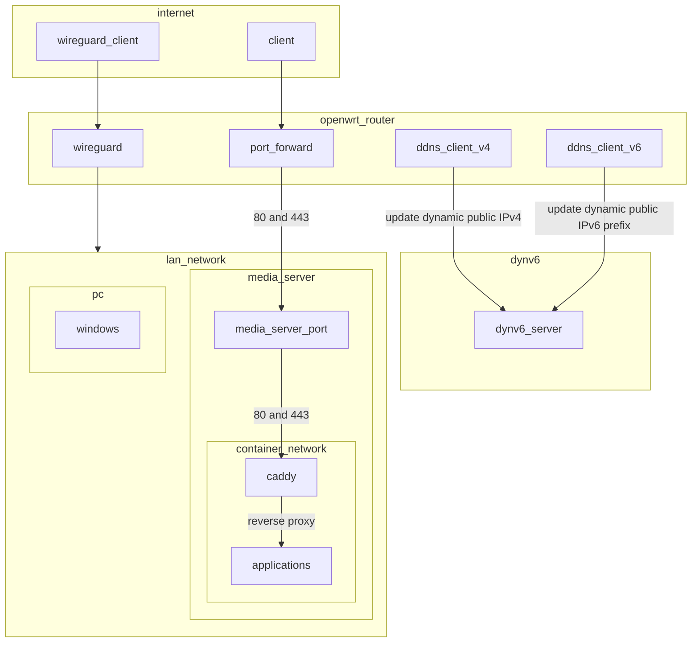
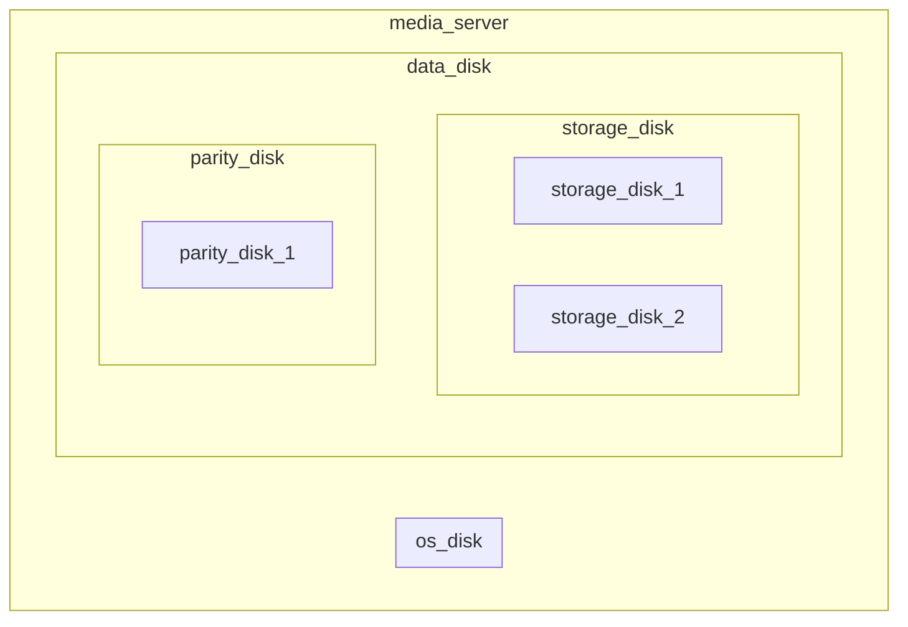

# Introduction
Code for running self-hosted services using podman and ansible
# Infrastructure graph
## Networking

## Data

# Note
- Always run partition playbook with --check first
```
ansible-playbook partition --check
```
# Troubleshooting
## Pymedusa
### Pymedusa failed create hardlink
- Check [this](roles/pymedusa/README.md)
### Check failed to hardlink file
- Run this command in the Video folder
```
find . -type f -links 1 ! -name "*.srt" -print
```
<!-- TODO: Write a scheduled monitoring for this -->
## Nextcloud
### Stuck in maintenance mode
1. Rebuild nextcloud
```
ansible-playbook container_run.yaml --tags nextcloud
```