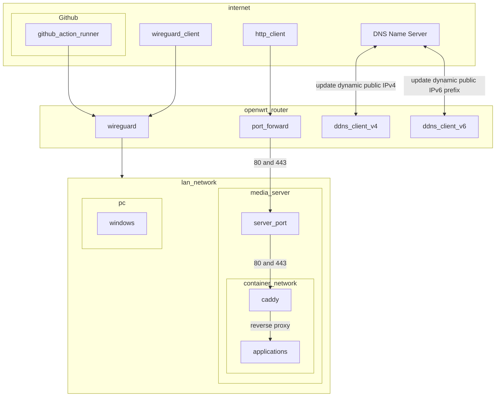
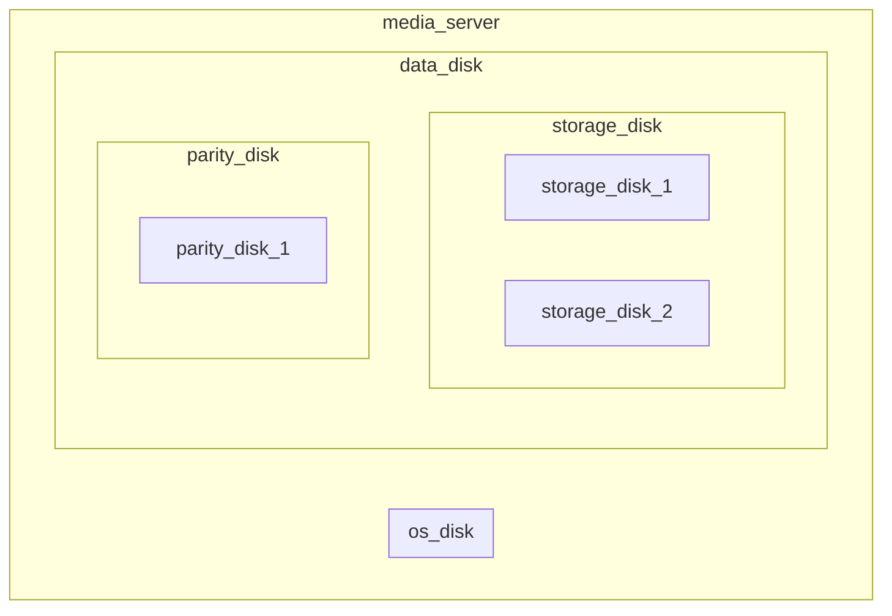

[](https://github.com/zephyros-dev/media-server/actions/workflows/deployment.yaml)

# Introduction

Code for running self-hosted services using podman and ansible

# Infrastructure graph

## Networking



## Data



# Note

- Always run partition playbook with --check first

```
ansible-playbook partition --check
```

# Troubleshooting

## Pymedusa

### Pymedusa failed create hardlink

- Check [this](roles/pymedusa/README.md)

### Check failed to hardlink file

- Run this command in the Video folder

```
find . -type f -links 1 ! -name "*.srt" -print
```

<!-- TODO: Write a scheduled monitoring for this -->

## Nextcloud

### Stuck in maintenance mode

1. Rebuild nextcloud

```
ansible-playbook container_run.yaml --tags nextcloud
```

## Server does not boot

- I used a HPZ230 for the server with an NVME hard drive in the PCIE slot.
- The mainboard does not allow booting from PCIE slot directly, so I have to boot from [Cloverboot](https://github.com/CloverHackyColor/CloverBootloader) installed in an USB.
  - It can be installed by downloading the release from the github page and burn the ISO to the USB.
- If PC fail to boot from the USB, the server will be stuck in the unbootable state.
- In this case, the troubleshooting steps involve:
  - Check if manual boot from usb is working
  - Check the boot order in the BIOS

# Note

## Koreader connection to opds Calibre content server

- The koreader opds requires `/opds` path to the calibre content server
- The calibre content server authentication need to be `digest` for the koreader opds
