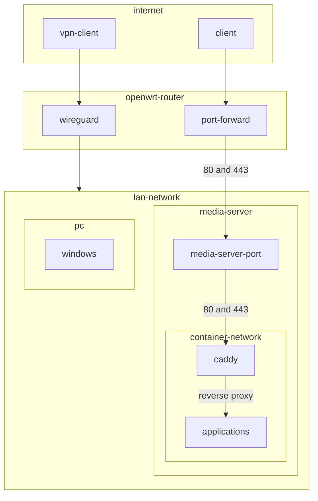

# Introduction
Code for running self-hosted services using podman and ansible
# Infrastructure graph

# Note
- Pods options
  - infra: no cannot be used with custom network
- When using podman with systemd, restart-policy cannot be on-failure:3
- Always run partition playbook with --check first
```
ansible-playbook partition --check
```
# Troubleshooting
## Nextcloud
### Stuck in maintenance mode
1. Run these commands
```
podman exec --user www-data -it nextcloud-web /bin/sh
php occ
php occ upgrade
php occ maintenance:mode --off
```