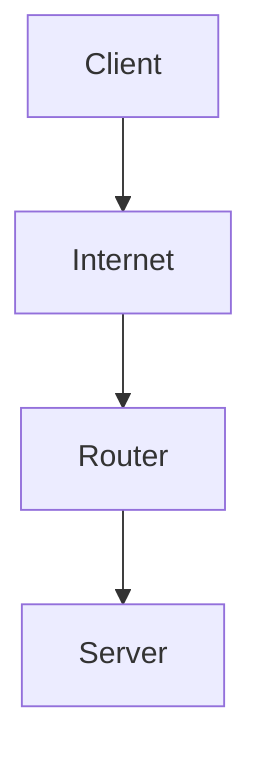

# Introduction

- In this document I'll introduce the concept of selfhosting and its component. This is not a guide or tutorial since it's too much to cover for me given how software and hardware changes over time. Instead, I'll provide a high level overview of the components and how they interact with each other so you can mix and match your own setup. That being said I'll try to give example of my setup in the concepts and my reasoning behind them so you can have a starting point.
- I assume that you want to do the following when selfhosting:
  - Have a personal cloud storage or a NAS that can serve files across network
  - Host some web applications (a blog, media server, etc..)

# Components

## Hardware

- Here are some minimum hardware components that makes up a selfhosted system
  - An internet line
  - [A router](https://www.cloudflare.com/learning/network-layer/what-is-a-router/)
  - A server
  - A client
    - This could be your phone, laptop, desktop, etc. They are used to access your selfhosted services

### Internet line

- This is the network line that connects you to the internet
- If you are a typical home user, 2 things will prevent you from selfhosting by default:
  - Your ISP (Internet Service Provider) blocks incoming traffic to your network, either by policy or by using [CGNAT](https://en.wikipedia.org/wiki/Carrier-grade_NAT)
    - In the first case, there's not much you can do other than changing the [ISP](https://en.wikipedia.org/wiki/Internet_service_provider)
    - In the second case, you may be able to request your ISP to stop doing this. In the case of my ISP, I just called their hotline and request them to allow incoming traffic to my network.
  - You probably won't have a static IP address
    - We can deal with this using a dynamic DNS client. More on this later

### Router

- This is the device that connects your network to the internet. Usually it's provided by your ISP.
- The only requirements needed for this device is to support port forwarding. Most modern routers support this feature.

### Server

- This is the machine that runs your selfhosted services. I assume in this guide that you will be using Linux. Using windows is possible but I don't recommend it.
- Unless you are looking for an ARM system which I won't cover here, a typical x86 server has the following components that you can buy:
  - CPU
    - Any CPU would work, but I'd advise buying a CPU with low power consumption unless you need some heavy workload.
    - The CPU should have an iGPU. It can be used for hardware transcoding media files or for remote access using [Intel AMT](https://en.wikipedia.org/wiki/Intel_Active_Management_Technology), AMD's equivalent, or [IPMI](https://en.wikipedia.org/wiki/Intelligent_Platform_Management_Interface)
  - Mainboard
    - A mainboard with IPMI or Intel AMT support is a plus. This allows you to control the server remotely from BIOS.
    - A mainboard with ECC support is a must if you are storing important data on the server.
  - RAM
    - RAM should be at least 8GB. 16GB is recommended. ECC ram is preferable.
    - A NVME hard drive is recommended for the OS. A SSD is also fine.
  - Hard drives
    - A HDD is recommended for data storage. Personally I prefer big hard drives over small one to reduce electricity usage. More than 2 is recommended for data redundancy. I use 3 hard drives in my server. 2 for data storage and 1 for parity.
  - Case
    - A case with good airflow and many hard drive trays is recommended. You can take some inspiration from [here](https://perfectmediaserver.com/06-hardware/cases/)

### Client

- This is the machine that you use to access your selfhosted services. This could be your phone, laptop, desktop, etc.

## Software

- For the most part, the meat of your selfhosted system software is on ther server. Here are some of my recommendations:

### OS

- Single machine distro
  - APT-based distro
    - A traditional option. I reccomend Debian if you go with this option.
  - Yum-based distro
    - Very similar to Debian based distro. Use either Fedora Server (for newer packages) or CentOS Stream (more stable) if you go with this option. Personally I used Fedora Server and I hadn't face stability issues yet.
  - Fedora IOT
    - Despite the name it can also be used for x86 server. AFAIK it uses the same packages as Fedora Server but have some interesting properties that may be useful for server. I haven't tried this one yet but an option worth considering if you have some time to tinker around.
- Hypervisor based
  - Proxmox
    - This is a fan favorite for selfhoster, use this if you want to tinker around. But if you're like me and just want to run services, I suggest sticking with the above options as adding a hypervisor adds complexity
- NixOS/Guix
  - Very advanced options, but probably the best one if you can stick with it. This one allows you to configure the whole OS using code.

### Container runtime

- I won't touch on the specific here since you can find more info online. The reason we use container is that they allow you to run the services without breaking the OS
- Some container runtime to consider:
  - Docker
    - The most popular one. You can find plenty of guides and tutorials online.
    - I personally don't use it since it needs root permission by default, and if you want to run it rootlessly, I'd suggest the other options
  - Podman
    - A rootless alternative to Docker. It works the same as Docker for the most part. Except when it doesn't, which requires you to do some more research. Personally I found the hassle worth it for the rootless feature. YMMV.
- You may find some people running Kubernetes. I don't recommend it due to the added complexity.

### Data and storage

- Regarding this topic, there are some components that you want to know:
  - [Filesystem](https://en.wikipedia.org/wiki/File_system)
    - The reason we care about this is because the choice of filesystem will affect the data redundancy strategy. I use btrfs for my filesystem since it is available by default on Fedora, and it has some nice features like incremental snapshot which will be useful for disk redundancy. There's also ZFS which is supposed to be better than btrfs, but it consumes more resources and need manual setup unless you use Proxmox.
  - If you care about your data, you will want `redundancy` (to deal with hard-drives failure) and `backup`.
    - For disk redundancy I used [mergerfs](https://perfectmediaserver.com/02-tech-stack/mergerfs/) and [snapraid](https://perfectmediaserver.com/02-tech-stack/snapraid/). I won't go into the details here, but you can find more info on the links.
    - For backup software, I use [restic](https://restic.net/) and backup to [B2](https://www.backblaze.com/cloud-storage)
      - Restic is a backup software that can backup to many cloud storage providers. I chose B2 because it's the cheapest option around

### Services

- There are too many selfhosted services to cover here. I'll just list some of the services that I think is useful for most people doing selfhosting and my choice of software for it:
  - Cloud storage (like Google Drive, Microsoft OneDrive, etc.)
    - Nextcloud
      - This is a very popular choice for selfhosted cloud storage. It also has a lot of features (calendar, contacts, etc.)
  - File synchorization
    - Syncthing
      - This is a very simple file synchronization software. It's easy to use and reliable.
      - You can also use Nextcloud, but I personally prefer Syncthing.
  - Media server (like Netflix)
    - Jellyfin
      - There's also Plex. While it has better UX, I still prefer Jellyfin since it's open source and free, while Plex is slowly getting worse. You'll have to pay for some features in Plex
  - Media getter
    - Radarr
      - This is a software that can automatically download movies.
    - Sonarr or Pymedusa
      - This is a software that can automatically download TV shows. Personally I used Pymedusa for reasons that I forgot, I believe it was because Pymedusa allows me to use custom name for the TV show post-processing
  - Image hostings (like Google Photos, etc.)
    - Immich
      - I use this one since it has client for both iOS and Android, with multi-user support. There's probably some other options, but I personally find this one to be good enough.

### Setup code

- You can setup your server manually, and many do. But if you intend to maintain the system for years to come and not just for a few months, you need to use code to setup your server. If you want to read more on this, checkout [Infrastructure as Code](https://en.wikipedia.org/wiki/Infrastructure_as_code)
- Personally I use [Ansible](https://www.ansible.com/) for this purpose. It has issues, but it's the most popular one so you can find plenty of resources online.
- Once you uses code to setup your server, you will want to setup a CD pipeline to deploy your code to the server. I use Github action for this.
- You will also need some way to manage secrets (think Token, API keys, etc...). I recommend using [sops](https://github.com/getsops/sops)

# Setup process

## Service setup

- Most service that I listed above has their own guide for setup. I recommend using docker/podman options for them
- Once you managed to reach your services from your LAN, you can move to the next stage

## Expose to the internet

- Once you have setup the services, you will want to expose them to the internet. This is done by port forwarding in your router. You can checkout a concept explanation [here](https://www.youtube.com/watch?v=2G1ueMDgwxw)
  - Regarding the port forwarding, you will want to setup a static IP assignment from the router doing DHCP to your server. You can find more info on how to do this in your router's manual.
  - You may have more than 1 NAT in your home (like an internet router -> another wifi router -> your server). In this case you can setup the internet router to forward every traffic to the wifi router instead using a feature called DMZ. Then you can setup the wifi router to port forward to your server. Or you can setup port forward twice for both router. The first one is easier but the second one is more secure. This setup also requires you to setup the static IP DHCP assignment on both router: the internet router to the wifi router, and the wifi router to the server.
  - Once done you can check if the port is open using port checker tools like [this](https://www.yougetsignal.com/tools/open-ports/)
  - My recommendation is that you only expose port 80, 443 of your server to the internet since it is used for HTTP services. You can use a reverse proxy to expose multiple services using the same port
- Once you setup the port forward, you will want to setup a domain to point to your public IP address. This is done by either buying a domain or using a free subdomain service. I personally use [Dynv6](https://dynv6.com/)
- A typical home network will not have static IP address. This means that your public IP address will change over time. So you will need a ddns client. Given that most router has barebone settings for this, I recommend setting it up on your server instead. I use [Caddy ddns client](https://github.com/mholt/caddy-dynamicdns) since I use Caddy as my reverse proxy.
- Regarding the reverse proxy, you will want to use one to expose your services to the internet. Nginx is probably your first result on google, but I recommend using Caddy for this purpose. It's easy to use and has automatic SSL certificate generation. You can find more info on how to setup Caddy as a reverse proxy [here](https://caddyserver.com/docs/quick-starts/reverse-proxy)
